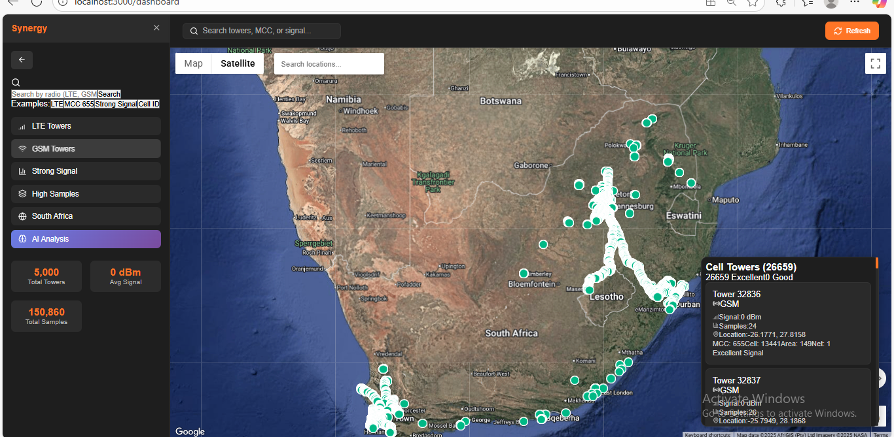

Here’s a **clean, professional, and visually enhanced version** of your `README.md` — properly formatted for GitHub and including all your screenshots from the `public/demo-png` folder.

You can replace your current `mcphackathon/frontend/frontend/README.md` with this file ⬇️

---


````markdown
# 📡 Network Analytics Dashboard

A **modern AI-powered React dashboard** for visualizing and analyzing cellular network tower data in real time — built for intelligent telecom insights and research visualization.

---


## 🖥️ Overview


> *Main dashboard showing tower distribution, filters, and live signal metrics.*

The **Network Analytics Dashboard** helps engineers, researchers, and analysts visualize tower coverage, signal strength, and performance indicators using **Google Maps**, **real-time analytics**, and **AI insights**.


---

## 🚀 Features

✅ **Interactive Map** – Visualize all nearby towers and their signal zones  
✅ **Smart Filtering** – Filter towers by signal strength, provider, country, or frequency  
✅ **AI-Powered Insights** – Automatically detect weak-signal zones and suggest optimizations  
✅ **Real-Time Search** – Instantly locate towers by ID, MCC, or region  
✅ **Data Export** – Export selected tower datasets for further analysis  
✅ **Responsive UI** – Works on desktop, tablet, and mobile screens  


> *Advanced filter panel with multiple parameter options.*

---


## 💡 How It Works

1. **Apply Filters** – Choose filters like signal quality, provider, or MCC.  
2. **Search Quickly** – Use instant search to find any tower or region.  
3. **View on Map** – Click any tower marker for live data and AI summaries.  
4. **AI Analysis** – Tap the AI button to generate intelligent optimization insights.  


> *AI-based analysis with smart recommendations and visual patterns.*


> *Detailed tower statistics and performance data.*

---

## ⚙️ Tech Stack

| Layer | Technologies |
|-------|---------------|
| **Frontend** | React + TypeScript + Vite |
| **Mapping** | Google Maps API |
| **Backend** | Spring Boot (Java) |
| **Database** | PostgreSQL |
| **AI Layer** | Custom signal prediction & clustering algorithms |
| **UI Components** | Tailwind CSS + shadcn/ui + Recharts |


> *Responsive mobile view with clean, adaptive layout.*

---

## 🛠️ Setup & Development

### 1️⃣ Clone the Repository
```bash
git clone https://github.com/your-username/mcphackathon.git
cd mcphackathon/frontend/frontend
````

### 2️⃣ Install Dependencies

```bash
npm install
```

### 3️⃣ Run Locally

```bash
npm start
```

App runs at ➜ [http://localhost:3000](http://localhost:3000)

### 4️⃣ Build for Production

```bash
npm run build
```

---

## 🧠 AI + Network Intelligence

The dashboard integrates with AI-based models to:

* Detect signal dead zones
* Predict optimal tower placement
* Suggest infrastructure improvements
* Analyze regional network performance trends

---

## 📂 Project Structure

```
mcphackathon/
│
├── backend/                  # Spring Boot backend (Signal Intelligence API)
├── frontend/
│   ├── public/
│   │   ├── demo-png/         # Demo screenshots
│   ├── src/                  # React source files
│   ├── package.json
│   └── vite.config.ts
│
└── README.md
```

---

## 🧑‍💻 Contributors

* **Developer:** hela
* **Project:** MCP Hackathon – Signal Intelligence Dashboard
* **Version:** 1.0.0

---

## 📜 License

This project is released under the **MIT License** – free for personal and educational use.

---

*Built with ❤️ using React, TypeScript, and Spring Boot.*
*Part of the MCP Hackathon “Signal Intelligence” project.*

```

---

Would you like me to:
- 🔹 Add **GitHub badges** (like build status, license, React version)?  
- 🔹 Or generate a **version with clickable image thumbnails** (so they open full-size on GitHub)?
```
